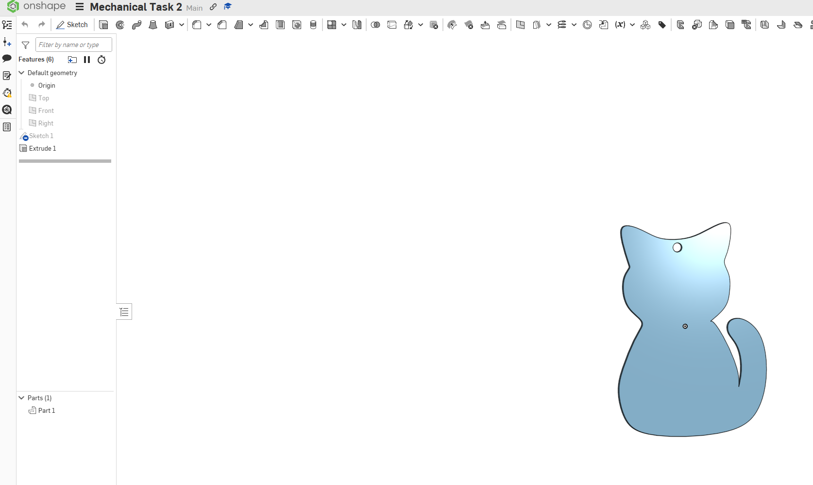

# Cat Keychain Using Onshape

## Overview

An Onshape mechanical design project that uses a cat image as a reference to create a 3D keychain with a 4 mm circular keyhole and a 2 mm extrusion.

## Components

- Onshape
- Cat Image
- STL File

## How It Works

The cat image was used as a reference to create the sketch.

A circular hole with a diameter of 4 mm was added as a keychain opening.

The design was then extruded by 2 mm and exported as an STL file.

## Design

## Design Dimensions

| Feature | Measurement |
|---|---|
| Keychain Hole | 4 mm |
| Extrusion | 2 mm |

## Onshape Design

[View Cat Keychain Design](https://cad.onshape.com/documents/c3c73ee7a6361375a396a2e0/w/e5c9317ad328351327be35a6/e/b6adea29aaf90d2ca947fc14)

## Result

The cat keychain was successfully created in Onshape, extruded to 2 mm, and exported as an STL file.

## Author

Wesal Ibrahim Alshareef

CS Student at Taif University
